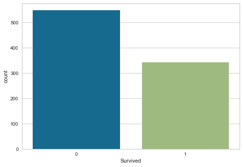
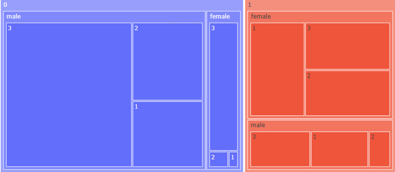

# Titanic Classification with Python

This is a classification project using Python and the Titanic data set. Our goal was to use different machine learning algorithms to predict which passengers survived and compare the results to determine which algorithm is best suited for this problem. The algorithms we tested were the naive Bayes, decision tree, random forest, k nearest neighbors, logistic regression, support vector machines and neural networks classifiers. The ones with the best performance were decision tree, random forest and logistic regression and the results for these three algorithms were not statistically distinct from each other.

## 1. Introduction

One of the most well known classification problems is that of the Titanic. The ship famously sunk during it's first voyage due to a collision with an iceberg, leading to the deaths of most of it crew and passengers. The idea behind the projects is, therefore, to use machine learning to predict which passengers would survive, based on the available passenger data. We repeated this process using different classification algorithms to find which one is the best fit for this particular problem.

The data set we will be using is the *train.csv* file (which we renamed *titanic.csv*) obtained from https://www.kaggle.com/competitions/titanic/data?select=train.csv at 15:02 (BRT) of 30/06/2022.

## 2. Exploratory Data Analysis

We can load the CSV file into Python using the pandas package. Before we use the machine learning algorithms, let us take a look at our data.

The file accounts for 891 of the passengers. Out of these, only 342 (approximately 38%) survived. Creating a tree map relating the attributes "Survived", "Sex" and "Pclass", we can see that sex was very significant in determining who survived, with most of the survivors (approximately 68%) being women. We can also see that most of the dead (approximately 68%) were in the third class, a class which accounted for approximately 55% of the total number of passengers.

Looking at each of the columns, we conclude that the "PassengerId" and "Name" attributes are unlikely to help the algorithms determine which of the passengers survived, since the values of these two columns are categorical and never repeat themselves. Therefore, we will not be using these two attributes.

Finally, we can see that there are some missing values in the data, specifically in the "Age", "Cabin" and "Embarked" columns. We will deal with these in the preprocessing step.

## 3. Preprocessing

We now must prepare our data for the classification algorithms. Our first step is to deal with the missing values.

For the "Age" column, since the values are numeric, we will replace the missing ones with the average age of the entire data set. For the "Cabin" column, since most of the values are missing, we will simply drop the column. For the "Embarked" column, since there are only two missing values, we will drop these two lines.

Next we separate our database between the predicting attributes and the class (what we want to predict), while dropping the "PassengerId" and "Name" columns, for the reasons that were explained in the previous section.

Then we use the label encoder to transform the three remaining categorical attributes ("Sex", "Ticket" and "Embarked") into numerical ones, followed by the one hot encoder, so that the machine learning algorithms will not assume an ordering where none exists.

Finally, we use the standard scaler on all of the predicting attributes, so that the algorithms will not assume that some (much larger) values are more important than others.

## 4. Classification Algorithms

Before we proceed with using the algorithms, let us illustrate the procedure we'll be following with each one.

The first step is the tuning of the parameters, that is, we test different values for the algorithms' parameters for different train-test splits and then select the parameters that led to the highest accuracy. This is done through the grid search function of the scikit-learn package.

Once we determine the parameters, we use the cross validation to determine the accuracy, where cross validation means using different train-test splits. We will set k=10, meaning that we are going to split the base in ten parts and alternate which one is used for the test, we will do this with 30 different splits. At the end of this process, we are going to have an array with 30 different values of accuracy, which we'll use to determine the average and the standard deviation. The higher the average accuracy and the lower the standard deviation, the better the algorithm has performed.

### 4.1. Naive Bayes

Let us begin with the naive Bayes classification algorithm. This algorithm uses the data to build a probability table and, with it, determine which class is more likely for a given entry.

This algorithm had no parameters, therefore we skip the tuning step.

We obtain that the average accuracy is 0.464486 and that the standard deviation is 0.005427.

### 4.2. Decision Tree

Next we will test the decision tree classifier. This algorithm creates a "tree", with the attributes as the nodes and their values as the branches, and uses this tree to determine to which class a given entry belongs.

Tuning the parameters, we have that the best value for "criterion" is "entropy", for "min_samples_leaf" it's 1, for "min_samples_split" it's 10 and for "splitter" it's "best".

We obtain that the average accuracy is 0.832918 and that the standard deviation is 0.007041.

### 4.3. Random Forest

The random forest algorithm is an improvement over the decision tree one. It employs multiple different trees and then decides based on the majority.

Tuning the parameters, we have that the best value for "criterion" is "gini", for "min_samples_leaf" it's 1, for "min_samples_split" it's 2 and for "n_estimators" it's 40.

We obtain that the average accuracy is 0.832315 and that the standard deviation is 0.005923.

### 4.4. K Nearest Neighbors (kNN)

The kNN classifier uses the values of each attribute of a given entry to determine it's distance to the existing entries, then assigns to the new entry the same class as the majority of its k nearest neighbors.

Tuning the parameters, we have that the best value for "n_neighbors" is 10 and for "p" it's 1.

We obtain that the average accuracy is 0.603638 and that the standard deviation is 0.022012.

### 4.5. Logistic Regression

The logistic regression classifier places the entries in a graph and draws a line that approximates them, allowing it to use the line to probabilistically predict the class of the new entries.

Tuning the parameters, we have that the best value for "C" is 1.5, for "solver" it's "sag" and for "tol" it's 0.000001.

We obtain that the average accuracy is 0.8267348 and that the standard deviation is 0.004958.

### 4.6. Support Vector Machines (SVM)

The SVM algorithm seeks to create hyperplanes separating entries belonging to different classes, and uses these hyperplanes to determine to which class the new entries belong.

Tuning the parameters, we have that the best value for "C" is 1, for "kernel" it's "linear" and for "tol" it's 0.001.

We obtain that the average accuracy is 0.821293 and that the standard deviation is 0.002826.

### 4.7. Neural Networks

The final algorithm we are going to test is the neural networks classifier. This algorithm was inspired by biological neural networks and works through artificial neurons, which emulate the behavior or natural neurons.

Tuning the parameters, we have that the best value for "activation" is "logistic", for "batch_size" it's 10 and for "solver" it's "adam".

We obtain that the average accuracy is 0.811182 and that the standard deviation is 0.009650.

## 5. Comparing the Classifiers

Now that we have the results for each classification algorithm, we can compare them and decide which one is best suited for this problem. Our first step in doing so is to verify if the results are statistically distinct from each other, this can be done with the ANOVA and Tukey tests, which compare normally distributed sets.

To determine if the results are normally distributed (null hypothesis) or not (alternative hypothesis) we will use the Shapiro function with alpha=0.05. That is, if we obtain a p-value smaller than 0.05, we reject the null hypothesis, otherwise we accept it. Thus, we obtain that all of the results are normally distributed.

Next, we can use the ANOVA test, which will compare all of the result sets and determine if they are statistically the same (null hypothesis) or not (alternative hypothesis). Employing this test, we obtain that the results are statistically distinct from each other.

Finally, we can employ the Tukey test, which will compare each result set with each other one and determine if they are statistically the same (null hypothesis) or not (alternative hypothesis). We obtain that the results for the decision tree, random forest and logistic regression classifiers are not statistically distinct. Since these algorithms were the ones with the highest accuracies, we may choose any of them as the best classifier for this problem.

## 6. Conclusion

We set out to solve the Titanic classification problem with multiple different machine learning algorithms, in order to compare the results and determine which classifier is best suited for this problem.

An initial analysis of the data revealed the importance of attributes such as sex and class, as well as a number of missing values, which had to be dealt with during preprocessing.

Once the data was in a suitable form, we tested the naive Bayes, decision tree, random forest, kNN, logistic regression, SVM and neural networks classifier. We obtained that the three algorithms with the best performance, decision tree, random forest and logistic regression, led to results that were not statistically distinct from each other, meaning that any of these three may be chosen and the best suited classifier.
